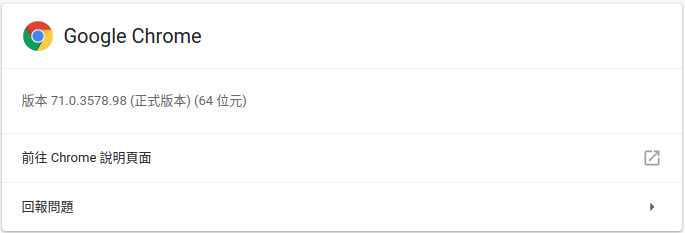

# Use selenium on Ubuntu
---
## Requirements
- OS Environment: **Ubuntu 16.04**
- system: **64-bit CPU** 
## Install
- google chrome
- chromedriver
- selenium 
### Install google chrome
download google chrome

	$ sudo dpkg -i google-chrome-stable_current_amd64.deb
	$ sudo apt-get install -f  

or if you use the older version of google chrome, you may do this step

	$ sudo apt-get update
    $ sudo apt-get install -y google-chrome-stable
    $ google-chrome -version

### Install chromedriver
check the **version of google chrome**

download the **corresponding version of [chromedriver](https://chromedriver.chromium.org/downloads)**

	$ sudo unzip unzip chromedriver_linux64.zip
    $ sudo chmod +x chromedriver
	$ sudo mv -f chromedriver /usr/local/bin

### Selenium

download selenium

	$ sudo apt install python-pip
    $ sudo pip install selenium
### Start coding
    
    $ touch web.py
## Resources
- [Installing Selenium and ChromeDriver on Ubuntu](https://christopher.su/2015/selenium-chromedriver-ubuntu/)
- [ubuntu上安裝及使用selenium和google-chrome和chromedriver](https://www.itread01.com/content/1543109607.html)
- [(網路爬蟲)運用selenium開啟chrome瀏覽器](https://medium.com/@bob800530/selenium-1-%E9%96%8B%E5%95%9Fchrome%E7%80%8F%E8%A6%BD%E5%99%A8-21448980dff9)

